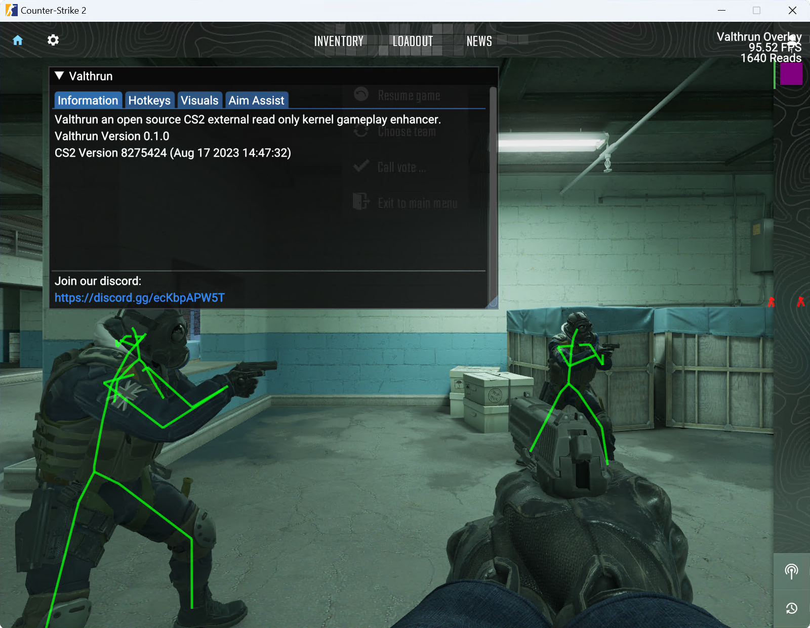

Holiton is an open-source external Counter-Strike 2 read-only kernel-level gameplay enhancer.

That's a lot of descriptive words — what does each one mean?

- **Holiton** — the name of this project
- **open source** — the application is open source so anyone can read, learn from and audit it
- **external** — no DLLs are injected into the target process
- **read only** — Holiton never writes to the CS2 process, so it cannot be detected by scanning the process memory
- **kernel** — kernel-level memory access; no user-mode WinAPIs are used to read CS2

This project is mainly a fun example for exploring the Windows kernel with [Rust](https://www.rust-lang.org) and the world of game enhancements.

# Looking for the ready-to-run build?

Source code lives here. If you just want to download and run Holiton, grab it from the distribution repo:

**[github.com/hitolox/holiton-loader-cs2](https://github.com/hitolox/holiton-loader-cs2)**

That repo ships `holiton-loader.exe`, which prepares the environment, fetches the kernel components on first run and launches the controller.

# WARNING

Holiton is **not** a plug-and-play solution. It aims for stealth and stays invisible to other applications, which means it requires careful setup:

- **Windows Defender must be disabled and the Holiton folder excluded.** `kdmapper.exe` is detected as `HackTool:Win32/Kdmapper` by every antivirus and will be silently quarantined.
- **HVCI (Memory Integrity) must be off** in Settings → Privacy & security → Windows Security → Device security → Core isolation.
- **Microsoft Vulnerable Driver Blocklist must be off** (same panel).
- **Administrator rights** are required to map the kernel driver — the loader requests them via UAC.

The full setup walkthrough is in the [loader repo's README](https://github.com/hitolox/holiton-loader-cs2#readme).

# Features

Because Holiton is read-only there are limits on what can be implemented (no skin changer, for example). It currently supports:

- **External radar** — publish your match to a web client
- **Player ESP** — `Skeleton`, `Boxes3D`, `Boxes2D`, configurable colours per team, health bar, weapon, distance
- **Bomb info** — defuse timer, plant site, time-to-detonation
- **Spectator list** — see who is observing you / your observer target
- **Trigger bot** — shoots the moment a target enters the crosshair
- **Sniper crosshair**, **bomb label**, **anti-aim punish**, **grenade helper**
- **Stream-proof by default** — the overlay never appears in screen shares or recordings

Press `PAUSE` in-game to open the Holiton overlay menu.

## Planned features

- Aimbot
- Player competitive ranks / wins

# Building from source

```bash
git clone https://github.com/hitolox/holiton-cs2.git
cd holiton-cs2
cargo build --release -p controller
```

The compiled binary lands at `target/release/controller.exe`. The loader is built the same way: `cargo build --release -p holiton-loader`.

The C runtime is statically linked (`+crt-static` in `.cargo/config.toml`), so the resulting binaries run on a fresh Windows install without VC++ Redistributable.

# VAC

The same considerations [discussed here](https://github.com/dretax/GarHal_CSGO#starting-driver) have been taken into account. With those precautions and some additional measures — omitting the project identifier from kernel-visible strings and XOR-encrypting strings — the driver/overlay aims to avoid VAC detection.

That said, I haven't extensively studied VAC and these conclusions are partly speculative. Personally I've used C-based driver/overlay setups like this with CS:GO for years without a VAC ban — but Overwatch is a separate vector, and VAC Live is now active. **Use at your own risk and take the necessary precautions.**

# Screenshots



